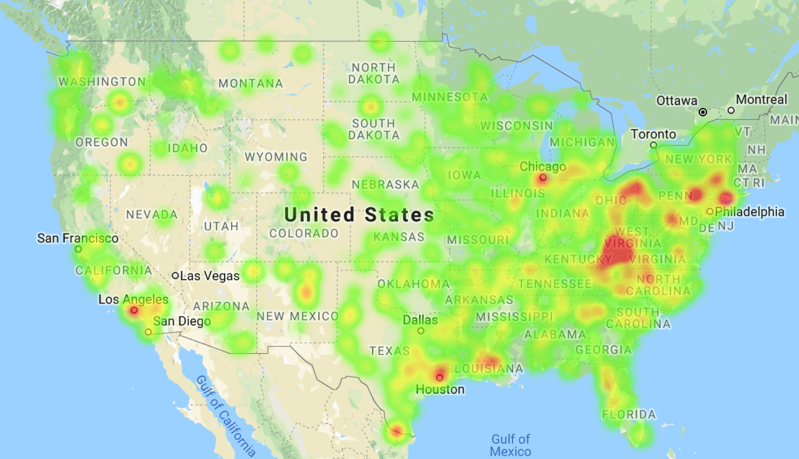
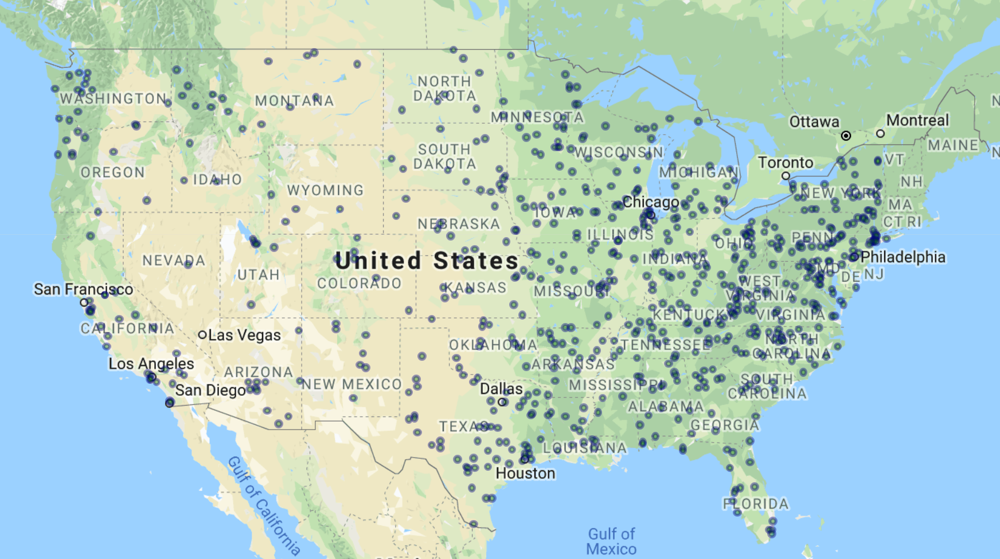
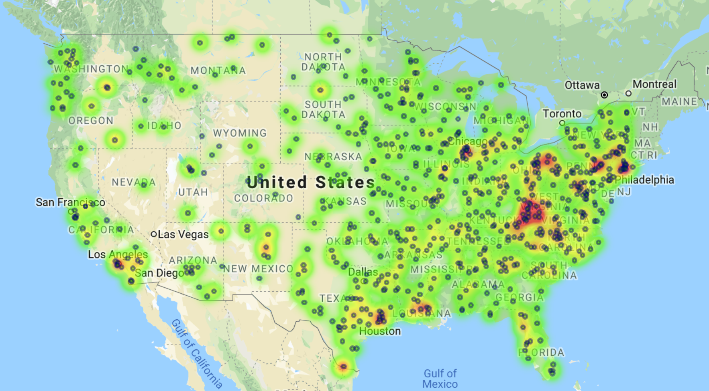

# Banking Deserts Heatmap

*  Visulizing the relationship between poverty and population with the number of banks in a given area.  Looking census data for every zip code across the country and maping this data by creating layered maps with Google maps.

# Maps

  ## A map with a `heatmap_layer` of the poverty rate for each city.
 
 

  ## A map with a `symbol_layer` for the number of banks located at that city.
  
  

  ## A map that includes both the poverty `heatmap_layer` and the bank `symbol_layer`.
  
   

### 
